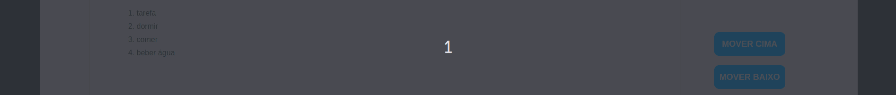

# project-todo-list

## Sobre o Projeto

Projeto que realizei na [Trybe](https://github.com/tryber), esse projeto tem como objetivo criar uma aplicação onde  a pessoa usuária pode criar uma lista de tarefas. Tem também como objetivo fixar o conteúdo aprendido sobre DOM além de proporcionar a busca de mais conhecimentos.

(<a href="#readme-top">back to top</a>)

## Construido Com
 1. **HTML5**
 2. **CSS**
 3. **JavaScript**
 4. **DOM**

(<a href="#readme-top">back to top</a>)

## Uso
 
 A pessoa usuária pode digitar sua tarefa no campo de texto depois clicar no botão "CRIAR" para adicionar.
 

A pessoa usuária pode selecionar uma tarefa clicando sobre ela, também é possível alterar a posição da tarefa ao selecioná-la e clicar no botão "MOVER CIMA", que move a tarefa para cima ou no botão "MOVER BAIXO", que move a tarefa para baixo.

A pessoa usuária pode marcar uma tarefa como concluída ao clicar duas vezes sobre ela, também é possível remover uma tarefa selecionada ao clicar no botão "REMOVER SELECIONADO".
Caso queira remover as tarefas concluídas é só clicar no botão "REMOVER CONCLUIDOS"
Para remover todas as tarefas é só clicar o botão "LIMPAR"

(<a href="#readme-top">back to top</a>)

## Contato

Renan Fernandes - [Linkedin](https://www.linkedin.com/in/orenanfernandes/)

Link do Projeto: [gitHub](https://github.com/RenanFernandess/project-todo-list)

(<a href="#readme-top">back to top</a>)

